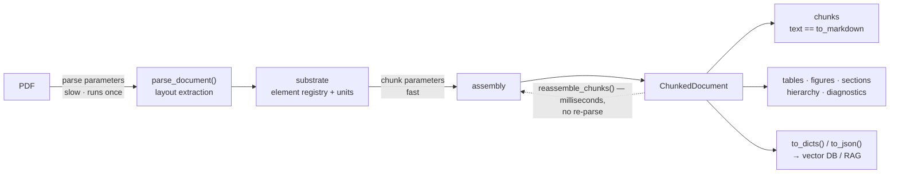

# Layout-Aware Chunking API

`pymupdf4llm.to_chunks()` splits a PDF into retrieval-friendly chunks using
PDF-native layout signals (box boundaries, font changes, vertical gaps, page
breaks) and returns a `ChunkedDocument` — a sequence of chunks plus the
document's structure: an element registry, table/figure/section views, a
section hierarchy, and ingestion diagnostics.

Chunk text is the **same markdown** `to_markdown()` emits for the same
boxes (rendered through the same renderers), so chunks never carry glued
words the renderer would have spaced correctly — a direct hit on
keyword-search recall (BM25 and similar): a term glued to its neighbor
is a term your keyword index cannot match.

Every Python block in this document runs as-is from the repository root
against PDFs shipped with the repository; `tests/test_chunking_docs.py`
executes them in order.

## Quick Start

```python
import pymupdf4llm

cd = pymupdf4llm.to_chunks("examples/country-capitals/national-capitals.pdf")

for c in cd:
    print(c.id, c.metadata.types, c.text.splitlines()[0])
# -> c0 ['heading', 'paragraph', 'table'] # **World Capital Cities**
#    c1 ['table'] |**Country**|**Capital**|**Population**|**%**|**Year**|
#    ...
```

## Two Ways to Call

```python
# 1. One-step: file path or pymupdf.Document
cd = pymupdf4llm.to_chunks("examples/country-capitals/national-capitals.pdf",
                           max_tokens=400)

# 2. Two-step: parse first, then chunk
from pymupdf4llm.helpers.document_layout import parse_document

doc = parse_document("examples/country-capitals/national-capitals.pdf")
cd = doc.to_chunks(max_tokens=400)
```

The one-step form accepts both parse and chunk parameters; they are split
internally by the `parse_document` signature. Unknown chunking parameters
raise `TypeError`.

## At a Glance

One slow layout extraction feeds one reusable substrate; everything
downstream — assembly, views, exports, re-chunking — is cheap:



The two parameter tiers below map onto the two arrows: parse parameters
change the substrate (re-parse required), chunk parameters only change
assembly (`reassemble_chunks()` is enough).

Assembly itself works in stages. Layout signals (box boundaries, box
classes, font changes, vertical gaps, page breaks) first propose cut
points; the resulting chunks are then refined in three passes:

1. **Split**: break oversized chunks at sentence boundaries.
2. **Semantic merge**: rejoin a heading with the content that follows it,
   and a caption with its figure or table.
3. **Budget merge**: greedily combine neighbouring chunks while the result
   stays within `max_tokens`. A section-opening chunk never merges
   backward into the previous section (`respect_section_starts=True`).

The semantic merge is what keeps a heading from being stranded at the end
of one chunk with its paragraph in the next, and a caption from being
separated from its figure or table. These are internal stages of
`to_chunks()` and `reassemble_chunks()`, not public methods; the chunk
parameters below are how you steer them.

## Parameters

### Parse Parameters

Passed to `parse_document()` internally.

| Parameter | Default | Description |
|---|---|---|
| `pages` | `None` | Pages to process (`None`=all, or list of 0-based page numbers) |
| `dpi` / `image_dpi` | `150` | Image extraction DPI |
| `ocr_dpi` | `150` | OCR DPI |
| `use_ocr` | (select) | OCR mode |
| `force_ocr` | `False` | Force OCR on all pages |
| `ocr_language` | `"eng"` | OCR language |
| `table_output` | `"markdown"` | `"html"` opts into the engine HTML table model (like `to_markdown`); needs a PyMuPDF with the layout-union table model, degrades to markdown tables with a warning otherwise. Changes `TableChunk` content (see Views) and re-splits boxes (see IDs) |
| `edge_threshold` | `None` | Layout GNN edge-probability cut for box grouping (engine default 0.55; lower merges more, higher fragments more) |
| `show_progress` | `False` | Show progress bar |

`table_output` and `edge_threshold` are substrate options: `reassemble_chunks()`
rejects them — re-parse via `to_chunks()` to change them.

### Chunk Parameters

| Parameter | Default | Description |
|---|---|---|
| `max_tokens` | `400` | Maximum tokens per chunk. The default targets embedding-model inputs; larger budgets (800–2000) suit long-context synthesis, rerankers, and section-first keyword retrieval — see recipes 5 and 6 |
| `min_tokens` | `120` | Minimum tokens (merge threshold) |
| `breakpoint_threshold` | `0.5` | Boundary score threshold for splitting |
| `merge_small_chunks` | `True` | Merge undersized chunks with neighbors |
| `table_mode` | `"preserve"` | `"preserve"`: table = one chunk; `"isolate"`: tables never budget-merge |
| `respect_section_starts` | `True` | Never budget-merge a section-opening chunk into the previous section's tail — chunk boundaries respect detected headings. Set `False` for pure token packing |
| `header_footer_mode` | `"exclude"` | `"exclude"` / `"auto"` (repeat detection) / `"include"` |
| `sentence_splitter` | `"default"` | `"default"` (English) or `"multilingual"` (CJK support) |
| `tokenizer` | `None` | tiktoken encoding name (unknown names raise `ValueError`), a `callable(text) -> int`, or `None` (character estimate) |
| `weights` | `None` | Boundary-score weight overrides |

Whether `contextual_text` is included in exports is decided at export
time: `ChunkedDocument.to_dicts()` / `.to_json()` take a keyword-only
`include_contextual` (default `True`).

### Choosing a budget

The 400-token default sits in the evidence-supported band for
general-purpose retrieval: chunking ablations find ~200 tokens best for
precision-oriented fact QA and 512–1024 for synthesis/analytical tasks,
with both extremes losing (Chroma, *Evaluating Chunking Strategies*;
NVIDIA, *Finding the Best Chunking Strategy*, 2025). Long-context
embedding models did not move this — their windows go to context
conditioning (late chunking, contextualized chunk embeddings), not to
bigger retrieval units. Layout-aware boundaries matter more than the
exact number (structure-based splitting beats size tuning in 2025–26
studies), and on layout-rich documents only ~10–40% of chunks hit the
budget cap at all — the rest end at headings, tables, and boxes. When a
different consumer needs a different size, `reassemble_chunks()` is the intended
answer (recipes 5 and 6), not a changed default.

## IDs Are a Contract

Every id format is stable across versions:

| Kind | Format | Example |
|---|---|---|
| chunk | `c{n}` | `c12` |
| table | `t{n}` | `t0` |
| figure | `f{n}` | `f3` (same `n` as `[Figure f3: WxH]` placeholders) |
| section | `s{n}` | `s2` |
| element | `p{page}.b{box}` | `p5.b7` (1-based page, 0-based box) |

**Scope**: element ids are stable for the same *(document bytes, package
version, parse options)*. Parse modes that re-split boxes (e.g. HTML
table rendering) change box indices — never cache ids across parse-option
changes.

**Chunk ids are positions.** `c{n}` is the n-th chunk in reading order, so
`cd.get("c3") is cd[3]`. They are local to one `ChunkedDocument`: a
`reassemble_chunks()` result numbers its own chunks from `c0` again.
Table, figure, section and element ids do not depend on the budget.

`cd.get(id)` resolves any of these; raises `KeyError` for an unknown id
unless you pass `default=`.

## ChunkedDocument

`to_chunks()` returns a `ChunkedDocument`. It is a `Sequence[Chunk]` in
reading order with the document structure attached:

```python
cd = pymupdf4llm.to_chunks("examples/country-capitals/national-capitals.pdf")

# Chunks: a sequence in reading order
len(cd)                        # 6
cd[0], cd[2:5]                 # a Chunk, a list of Chunks
cd.index(cd[3])                # 3 (Sequence protocol: iteration, slicing, index)
cd.chunks                      # the same chunks as a tuple
cd.text                        # all chunk text joined (lazy)

# Structure
cd.elements                    # every layout box, header/footer included (Element)
cd.tables                      # list[TableChunk]   (see Views)
cd.figures                     # list[FigureChunk]
cd.sections                    # list[SectionChunk]
cd.hierarchy                   # sections as a SectionNode tree (root level 0)
cd.get("c0")                   # any public id: c{n}, t{n}, f{n}, s{n}, p{page}.b{box}
cd.get("t0"), cd.get("s0"), cd.get("p1.b0")
cd.get("nope", default=None)   # KeyError without default=

# Exports (JSON-safe; content_hash included)
cd.to_dicts()                  # list[dict], schema below
cd.to_json(indent=2)           # json.dumps(cd.to_dicts()); extra kwargs go to json.dumps
cd.to_dicts(include_contextual=False)   # drop contextual_text from the payload
# Framework exports need optional dependencies (recipe 7):
#   cd.to_langchain_documents()   -> list[langchain_core.documents.Document]
#   cd.to_llama_nodes()           -> list[llama_index.core.schema.TextNode]

# Re-chunking, diagnostics, provenance
cd.reassemble_chunks(max_tokens=200)   # new ChunkedDocument from retained units, no re-parse
cd.diagnostics                 # dict for an ingestion gate (keys below)
cd.params                      # read-only mapping of the parameters cd was built with
cd.contextualize(cd[0])        # == cd[0].contextual_text
```

`reassemble_chunks()` accepts assembly-tier parameters only (`max_tokens`,
`min_tokens`, `breakpoint_threshold`, `table_mode`, `merge_small_chunks`,
`respect_section_starts`). Substrate parameters (`sentence_splitter`,
`header_footer_mode`, `tokenizer`, `weights`) and parse options raise
`ValueError` — call `to_chunks()` on a new parse instead. It returns a new
`ChunkedDocument`; the original is unchanged.

### Chunk

```text
Chunk:
    id: str                    # "c0", "c1", ... (position in this ChunkedDocument)
    text: str                  # markdown, identical to to_markdown's rendering
    contextual_text: str       # text with [Section], [Page], [Type] tags (format below)
    content_hash: str          # lazy sha256 of whitespace-normalized text
    metadata: ChunkMetadata
```

### ChunkMetadata

```text
ChunkMetadata:
    page_start, page_end: int  # 1-based original page numbers (survive pages=)
    element_ids: list[str]     # ["p1.b0", ...] — evidence addresses
    section_path: list[str]    # citation path = the owning section's path
    section_id: str | None     # innermost section ("s{n}")
    table_ids: list[str]       # tables in this chunk ("t{n}")
    figure_ids: list[str]      # figures in this chunk ("f{n}")
    types: list[str]           # element types present, in order:
                               # "heading", "paragraph", "table", "list", "figure", "caption", ...
    bboxes: list[tuple]        # (page, x0, y0, x1, y1)
    lists: list[dict]          # logical list groups
    token_count: int           # per-chunk token count
    ocr: bool                  # True when a source page went through OCR
    file_path, page_count
```

### to_dicts() schema

One dict per chunk; `metadata` carries every `ChunkMetadata` field as-is:

```text
{
    "id": "c0",
    "text": "...",
    "content_hash": "6adc89bf...",
    "contextual_text": "...",          # omitted with include_contextual=False
    "metadata": {
        "page_start": 1, "page_end": 1, "bboxes": [...],
        "types": ["heading", "paragraph", "table"],
        "section_id": "s0", "section_path": ["World Capital Cities"],
        "token_count": 351, "element_ids": ["p1.b0", "p1.b1", "p1.b2"],
        "table_ids": ["t0"], "figure_ids": [], "lists": [], "ocr": false,
        "file_path": "...", "page_count": 6
    }
}
```

### diagnostics

`cd.diagnostics` reports facts about the parse for an ingestion gate; your
pipeline owns the thresholds (recipe 2). Values shown are for the example
document:

```text
{
    "chunk_count": 6, "element_count": 14, "table_count": 6, "figure_count": 0,
    "section_count": 1, "page_count": 6,
    "pages_without_chunks": [],      # 1-based pages no chunk covers
    "zero_chunk_causes": [],         # only when chunk_count == 0: "no_text_extracted",
                                     # "all_units_header_footer" or "all_units_filtered"
    "figures_without_text": [],      # figure ids with no extractable text (OCR candidates)
    "degenerate_tables": [],         # table ids whose rendering is empty
    "header_footer_excluded": 6      # units dropped by header_footer_mode
}
```

### Views

`cd.tables`, `cd.figures` and `cd.sections` are lists of these objects;
each links back to the chunk that holds it (`chunk_id`), and the chunk
links forward via `metadata.table_ids` / `figure_ids` / `section_id`:

```text
TableChunk:   id                # "t{n}"
              chunk_id          # id of the chunk holding this table ("c{n}")
              element_id, page, bbox
              markdown | html   # mutually exclusive by parse mode
              headers           # header cell texts from <th>; [] on markdown parses
              caption, caption_element_id
              section_id        # innermost section ("s{n}")
              token_count
              text              # canonical rendering for the parse mode

FigureChunk:  id                # "f{n}"
              chunk_id          # id of the chunk holding this figure
              element_id, page, bbox, boxclass
              ocr_text          # extracted text; None → OCR candidate
              placeholder       # "[Figure f{n}: WxH]" when there's no text
              caption, caption_element_id
              section_id        # innermost section ("s{n}")
              image             # bytes when extract_images=True
              has_text          # bool(ocr_text and ocr_text.strip())

SectionChunk: id                # "s{n}"
              title, level, page_start, page_end
              heading_element_id
              path              # titles, root → self
              element_span      # [start, end) into ChunkedDocument.elements
              child_chunk_ids   # chunks under this section, subtree included
              token_count       # sum over child chunks
              text              # lazy, assembled from the element registry
```

`TableChunk.markdown` is never backfilled with HTML: in HTML table mode
the parser carries `markdown=None` and `html` is canonical; on markdown
parses `html is None` and `headers == []` (header identity comes only
from the engine's `<th>`, never from local heuristics).

**Sections have a single source of truth**: the layout-detected heading
boxes (`section-header`/`title`). The `sections` view, `hierarchy`, and
`chunk.metadata.section_path` (= the innermost owning section's `path`)
all derive from that same heading walk — the PDF TOC is never consulted,
so a document without bookmarks still gets a fully populated
`section_path`, always consistent with the views. Chunk boundaries also
respect this structure: with `respect_section_starts=True` (default) a
section-opening chunk is never budget-merged into the previous section's
tail.

**Sections nest.** `SectionChunk.level` is the engine's font-statistics
heading level — the same value the renderers use for `#`/`##`/`###`
depth — so big headings contain small ones: a level-4 section's `path`
carries all its ancestors, and `cd.hierarchy` exposes the same nesting
as a `SectionNode` tree (root level 0). The section tree therefore
always matches the heading depth visible in the rendered markdown.

A real document makes the ownership rules concrete. `tests/test_370.pdf`
is a five-page paper with nested headings; `own` = chunks whose
`section_id` is this section, `subtree` = the rollup over the section and
everything nested under it:

```python
cd_p = pymupdf4llm.to_chunks("tests/test_370.pdf")
own = {}
for c in cd_p:
    own.setdefault(c.metadata.section_id, []).append(c.id)
for s in cd_p.sections:
    print("   " * (s.level - 1) + f"{s.id} L{s.level} {s.title[:22]!r}",
          f"own={own.get(s.id, [])}",
          f"subtree={len(s.child_chunk_ids)}ch/{s.token_count}tok")
```

```text
s0 L1 'Synthesis of Silyl Die' own=['c0'] subtree=21ch/4711tok
   s1 L2 'Masahiro Sai' own=['c1', 'c2', 'c3', 'c4', 'c5', 'c6', 'c7', 'c8', 'c9', 'c10'] subtree=20ch/4688tok
      s2 L3 'AUTHOR INFORMATION' own=['c11'] subtree=3ch/43tok
         s3 L4 'Corresponding Author' own=['c12'] subtree=1ch/21tok
         s4 L4 'Notes' own=['c13'] subtree=1ch/16tok
      s5 L3 'ACKNOWLEDGMENT' own=['c14'] subtree=1ch/24tok
      s6 L3 'REFERENCES' own=['c15', 'c16', 'c17', 'c18', 'c19', 'c20'] subtree=6ch/1637tok
```

`s5` shows the stack popping back: after the level-4 `Notes`, a level-3
heading closes both `s4` and `s2` and becomes a sibling of `s2`.

- **Ownership is innermost.** Content attaches at whatever depth it
  appears: the `Corresponding Author` heading and the e-mail line under
  it form chunk `c12` with `section_id="s3"` and
  `section_path=[..., "AUTHOR INFORMATION", "Corresponding Author"]`,
  one unambiguous address per chunk.
- **Heading-only sections** still exist in the tree, owning just their
  own heading chunk (`s2` owns `c11`, the 6-token `### **AUTHOR
  INFORMATION**` line) until a same-or-shallower heading closes them;
  the content lives in the child sections `s3` and `s4`.
- **Ancestors aggregate.** `child_chunk_ids` and `token_count` cover the
  whole subtree (`s2` rolls up `["c11", "c12", "c13"]`, 43 tokens), and
  `element_span`s nest: `s2` `(34, 39)` contains `s3` `(35, 37)`. Feed a
  whole branch to an LLM via `SectionChunk.text` (recipe 6).
- **Before the first heading**, chunks stay unowned: `section_id=None`,
  `section_path=[]` (a cover-page figure, for instance; a document with
  no headings at all, such as `tests/test_sce_150_1.pdf`, has
  `cd.sections == []` and every chunk unowned).

## Cookbook

The recipes below are for people building a retrieval pipeline on top of
`to_chunks()`. Each one runs as-is from the repository root against a PDF
shipped with the repository, and every `# ->` line is real output
captured on pymupdf 1.28.2.

**Reader-side placeholders.** The recipes need things pymupdf4llm does
not provide: an embedding model, a vector store, a keyword index, a
retriever, an LLM. Each recipe defines the ones it needs as tiny stand-in
stubs between a `# --- your code: ... ---` and a `# --- end of your code ---`
comment; replace those with your own implementations. Everything outside
those markers is pymupdf4llm API: every attribute or method called on
`cd`, on a chunk, or on a table/figure/section view is documented in the
sections above.

`cd` in the recipes is the example document, six pages of capital-city
tables; recipes that use another PDF parse it themselves:

```python
import pymupdf4llm

cd = pymupdf4llm.to_chunks("examples/country-capitals/national-capitals.pdf")
for c in cd:
    print(c.id, c.metadata.types, c.metadata.token_count, c.metadata.element_ids)
# -> c0 ['heading', 'paragraph', 'table'] 351 ['p1.b0', 'p1.b1', 'p1.b2']
#    c1 ['table'] 377 ['p2.b0']
#    c2 ['table'] 365 ['p3.b0']
#    c3 ['table'] 373 ['p4.b0']
#    c4 ['table'] 399 ['p5.b0']
#    c5 ['table'] 369 ['p6.b0']
```

### 1. Embed with context and upsert with stable ids

Embed `contextual_text`, not `text`: it prefixes the section path, page
and element types, so the vector carries where the chunk sits in the
document. `[Section]` comes from the layout-detected heading structure;
this document has no PDF bookmarks, and none are needed.

```python
print(cd[0].contextual_text[:130])
# -> [Section] World Capital Cities
#    [Page] 1
#    [Type] heading, table
#    [Content]
#    # **World Capital Cities**
#    _Percent "%" is city population
```

Assemble the vector-store point id from stable scopes; re-ingesting the
same document version then *updates* instead of duplicating. Keep ids for
machines and citations (`section_path`, pages) for humans: never show a
point id to a user, never parse a citation back into an id. Treat the id
assembly rule as immutable code, since changing it re-keys the whole
collection.

```python
# --- your code: replace with your embedding model and vector store ---
def embed(text):
    return [0.0] * 8                 # stand-in for an embedding vector

class VectorStore:
    def __init__(self):
        self.points = {}

    def upsert(self, id, vector, payload):
        self.points[id] = (vector, payload)

store = VectorStore()
doc_id = "9f2d"                      # your document identity, e.g. sha256 of the file bytes
# --- end of your code ---

def point_id(c, *, tenant, kb, doc_id, emb_ver):
    return f"{tenant}:{kb}:{doc_id}:{c.metadata.page_start}:{c.id}:{emb_ver}"

for c, payload in zip(cd, cd.to_dicts()):
    store.upsert(
        id=point_id(c, tenant="acme", kb="manuals", doc_id=doc_id, emb_ver="e5-large-v2"),
        vector=embed(c.contextual_text),
        payload={**payload, "citation": {
            "section": " > ".join(c.metadata.section_path),
            "pages": [c.metadata.page_start, c.metadata.page_end]}},
    )

pid = point_id(cd[0], tenant="acme", kb="manuals", doc_id=doc_id, emb_ver="e5-large-v2")
print(pid)
# -> acme:manuals:9f2d:1:c0:e5-large-v2
print(store.points[pid][1]["citation"])
# -> {'section': 'World Capital Cities', 'pages': [1, 1]}
```

On re-ingest, `content_hash` (sha256 of whitespace-normalized chunk text)
tells you which chunks actually changed, so only those are re-embedded:

```python
# --- your code: content hashes stored by the previous ingest, keyed by chunk id ---
previous = {c.id: c.content_hash for c in cd}      # here: the same document, unchanged
# --- end of your code ---

changed = [c for c in cd if previous.get(c.id) != c.content_hash]
print(len(changed), cd[0].content_hash[:16])
# -> 0 6adc89bfaeef7db4
```

### 2. Ingestion gate wiring

`cd.diagnostics` is the machine-readable input for a PROCEED/HOLD/REJECT
decision. It reports facts; your pipeline owns the thresholds. This is
how you catch "a perfectly fine document quietly produced 0 chunks"
before it poisons an index:

```python
def gate(d):
    """Verdict from cd.diagnostics; the rules are yours to tune."""
    if d["chunk_count"] == 0:
        return "REJECT", d["zero_chunk_causes"]                 # nothing usable
    if d["pages_without_chunks"] or d["degenerate_tables"]:
        return "HOLD", {"pages": d["pages_without_chunks"],
                        "tables": d["degenerate_tables"]}      # human review
    if d["figures_without_text"]:
        return "PROCEED_WITH_OCR_QUEUE", d["figures_without_text"]
    return "PROCEED", None

print(cd.diagnostics)
# -> {'chunk_count': 6, 'element_count': 14, 'table_count': 6, 'figure_count': 0,
#     'section_count': 1, 'page_count': 6, 'pages_without_chunks': [],
#     'zero_chunk_causes': [], 'figures_without_text': [], 'degenerate_tables': [],
#     'header_footer_excluded': 6}
print(gate(cd.diagnostics))
# -> ('PROCEED', None)
```

### 3. Tables and figures as first-class citations

`cd.tables` and `cd.figures` give every table and figure its own id, page
and bbox, plus the chunk that holds it, so they can be indexed and cited
on their own. `tests/test_tablulate_bug.pdf` is a one-page document with
two tables and two figures:

```python
cd_t = pymupdf4llm.to_chunks("tests/test_tablulate_bug.pdf")
print(cd_t)
# -> ChunkedDocument(chunks=4, tables=2, figures=2, sections=4)

# --- your code: replace with your table index and OCR queue ---
table_index = {}
ocr_queue = []
# --- end of your code ---

for t in cd_t.tables:
    table_index[t.id] = {"text": t.text, "headers": t.headers,
                         "cite": (t.page, t.bbox),
                         "context": cd_t.get(t.chunk_id).text}   # the whole owning chunk
    print(t.id, t.chunk_id, t.page, t.headers, t.text[:27])
# -> t0 c1 1 [] |**Targets**|**Weighting**|
#    t1 c3 1 [] ||||||||**Total value of**|

for f in cd_t.figures:
    if not f.has_text:                                        # no extractable text
        ocr_queue.append((f.id, f.page, f.bbox))
print(ocr_queue)
# -> [('f1', 1, (758.0, 152.0, 1021.0, 265.0)), ('f2', 1, (758.0, 336.0, 1021.0, 372.0))]
print(cd_t.diagnostics["figures_without_text"])
# -> ['f1', 'f2']      (the same ids, if you prefer to read them from diagnostics)
```

For header-aware table retrieval, parse with `table_output="html"`:
`t.text` becomes the engine's HTML (colspan/rowspan preserved) and
`t.headers` carries the `<th>` cell texts, but only when the engine's
header detection fires; otherwise `headers` stays `[]`, exactly as on
markdown parses:

```python
cd_h = pymupdf4llm.to_chunks("tests/test_sce_150_1.pdf", table_output="html")
t1 = cd_h.get("t1")
print(t1.markdown, "<th" in t1.html, t1.headers)
# -> None True ['Alternate Calculation with Reinsurance', '', '', '']
```

### 4. Context window around a hit

A `ChunkedDocument` is a list in reading order, so the chunks around a
search hit are just a slice around its position. Nothing is stored per
chunk for this; `c{n}` is the position, and `cd.index()` gives it for a
chunk object.

```python
hit = cd.get("c3")                    # the chunk id your search returned
i = cd.index(hit)                     # 3
window = cd[max(0, i - 2): i + 3]     # two before, the hit, two after
print([c.id for c in window])
# -> ['c1', 'c2', 'c3', 'c4', 'c5']

edge = cd[max(0, 0 - 2): 0 + 3]       # a hit on c0: the slice simply clamps
print([c.id for c in edge])
# -> ['c0', 'c1', 'c2']
```

### 5. Budget tuning and small-to-big retrieval

Different budgets serve different consumers: the default 400 targets
embedding-model inputs; 800–1200 suits rerankers and long-context
synthesis; ~2000 suits section-first keyword retrieval (recipe 6).
`reassemble_chunks()` re-runs assembly from the retained units, so one
parse serves them all:

```python
for budget in (200, 400, 800):
    print(budget, len(cd.reassemble_chunks(max_tokens=budget)))
# -> 200 7
#    400 6
#    800 3        (about a millisecond each; no re-parse)
```

Measured on a 1,003-page reference PDF (pymupdf 1.28.2): parse ~36 min
once, then `reassemble_chunks()` 0.7–1.2 s per budget — three orders of
magnitude cheaper than re-parsing per configuration.

Small-to-big retrieval is the same idea at query time: search precisely
over small chunks, feed the LLM the surrounding big chunk. Both
granularities come from the same parse and share element addresses, so
the mapping is a set intersection, no extra bookkeeping:

```python
big = cd.reassemble_chunks(max_tokens=1200)     # 2 chunks: c0 pages 1-3, c1 pages 4-6

# --- your code: replace with your retriever and LLM ---
def search(query):
    return "c1"                       # a small-chunk id from your index

def llm(query, context):
    return f"answer grounded in {len(context)} characters"
# --- end of your code ---

query = "What is the capital of Belgium?"
small = cd.get(search(query))                   # from cd, the 400-token index
context = next(b for b in big
               if set(small.metadata.element_ids) & set(b.metadata.element_ids))
answer = llm(query, context.text)
print(small.id, small.metadata.token_count, "->", context.id,
      context.metadata.token_count, context.metadata.page_start, context.metadata.page_end)
# -> c1 377 -> c0 1093 1 3
```

### 6. Section-first chunking for keyword search and browsing

Keyword search without embeddings, and browsing a document by section,
usually want section-shaped units around ~2000 tokens rather than
embedding-sized ones. Large budgets keep section purity because a
section-opening chunk never budget-merges backward
(`respect_section_starts=True`, the default). `tests/test_370.pdf` is a
five-page paper with 7 sections:

```python
cd_p = pymupdf4llm.to_chunks("tests/test_370.pdf")
big = cd_p.reassemble_chunks(max_tokens=2000)
by_section = {}
for c in big:
    by_section.setdefault(c.metadata.section_id, []).append(c.id)
print(len(big), by_section)
# -> 8 {'s0': ['c0'], 's1': ['c1', 'c2'], 's2': ['c3'], 's3': ['c4'],
#       's4': ['c5'], 's5': ['c6'], 's6': ['c7']}
#    every chunk sits inside exactly one section

glued = cd_p.reassemble_chunks(max_tokens=2000, respect_section_starts=False)
print(len(glued), [c.metadata.section_id for c in glued])
# -> 3 ['s1', 's1', 's6']      sections packed together
```

Index each entry under `" > ".join(chunk.metadata.section_path)` so a hit
can be shown and navigated by section.

The sections view itself is often the better keyword-search unit. A
chunk hit can be a heading-only chunk (a heading followed directly by a
subheading carries no body text), but a section is never under-evidenced:
`SectionChunk.text` assembles the section's whole subtree, its heading
plus every child section's content, and `token_count` is the subtree
rollup, so oversized branches are easy to filter before indexing:

```python
# --- your code: replace with your keyword index ---
keyword_index = {}
# --- end of your code ---

for s in cd_p.sections:
    if s.token_count <= 4000:              # whole subtree fits the budget
        keyword_index[s.id] = {"text": s.text, "path": " > ".join(s.path)}
print(sorted(keyword_index))
# -> ['s2', 's3', 's4', 's5', 's6']      (s0 and s1 span the whole paper: 4711 / 4688 tokens)

# Or expand a chunk hit to its owning section at query time:
hit = cd_p.get("c11")
print(repr(hit.text), hit.metadata.token_count, hit.metadata.section_id)
# -> '### **AUTHOR INFORMATION**' 6 s2           (a heading-only chunk)
section = cd_p.get(hit.metadata.section_id)
print(section.token_count, section.child_chunk_ids, section.text[:87])
# -> 43 ['c11', 'c12', 'c13'] ### **AUTHOR INFORMATION**
#
#    #### **Corresponding Author**
#
#    *saimasa@mat.shimane-u.ac.jp
```

### 7. Framework export

```python
docs = cd.to_langchain_documents()   # needs langchain-core
nodes = cd.to_llama_nodes()          # needs llama-index-core
# -> 6 Documents / 6 TextNodes; docs[0].page_content == cd[0].text,
#    metadata: the ChunkMetadata fields (page_start, page_end, bboxes, types, ...)
```

## contextual_text Format

```
[Section] Chapter 1 > Section 1.2
[Page] 5
[Type] heading, table
[Content]
{chunk.text}
```

- `[Section]` appears only when `section_path` is non-empty.
- `[Type]` lists `metadata.types` without `"paragraph"`; the line is
  omitted when `"paragraph"` is the only type.

## Token counting

Chunk budgets sum precomputed per-unit token counts (no re-tokenizing of
joined text). The sum may differ from tokenizing the final chunk text by
at most the number of unit joins — budgets are targets, not guarantees.
Pass `tokenizer="cl100k_base"` (tiktoken) or a callable for exact counts
per unit; the default is a 4-chars-per-token estimate. An unknown tiktoken
encoding name raises `ValueError` rather than silently falling back.

The resulting total is exposed as `metadata.token_count`, and on the
`TableChunk` / `SectionChunk` views as `token_count`.
