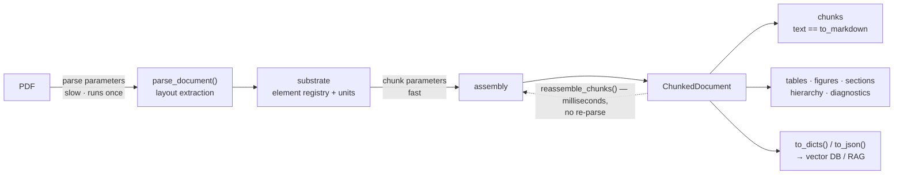

# Layout-Aware Chunking API

`pymupdf4llm.to_chunks()` splits a PDF into retrieval-friendly chunks using
PDF-native layout signals (box boundaries, font changes, vertical gaps, page
breaks) and returns a `ChunkedDocument` — a sequence of chunks plus the
document's structure: an element registry, table/figure/section views, a
section hierarchy, and ingestion diagnostics.

Chunk text is the **same markdown** `to_markdown()` emits for the same
boxes (rendered through the same renderers), so chunks never carry glued
words the renderer would have spaced correctly — a direct hit on
sparse/BM25 recall: a term glued to its neighbor is a term your keyword
index cannot match.

## Quick Start

```python
import pymupdf4llm

cd = pymupdf4llm.to_chunks("input.pdf")

for c in cd:
    print(c.id, c.metadata.chunk_type, c.text[:80])
```

## Two Ways to Call

```python
# 1. One-step: file path or pymupdf.Document
cd = pymupdf4llm.to_chunks("input.pdf", max_tokens=400)

# 2. Two-step: parse first, then chunk
from pymupdf4llm.helpers.document_layout import parse_document

doc = parse_document("input.pdf")
cd = doc.to_chunks(max_tokens=400)
```

The one-step form accepts both parse and chunk parameters; they are split
internally by the `parse_document` signature. Unknown chunking parameters
raise `TypeError`. (`to_chunk()` still works but emits a
`DeprecationWarning`.)

## At a Glance

One slow layout extraction feeds one reusable substrate; everything
downstream — assembly, views, exports, re-chunking — is cheap:



The two parameter tiers below map onto the two arrows: parse parameters
change the substrate (re-parse required), chunk parameters only change
assembly (`reassemble_chunks()` is enough).

## Parameters

### Parse Parameters

Passed to `parse_document()` internally.

| Parameter | Default | Description |
|---|---|---|
| `pages` | `None` | Pages to process (`None`=all, or list of 0-based page numbers) |
| `dpi` / `image_dpi` | `150` | Image extraction DPI |
| `ocr_dpi` | `150` | OCR DPI |
| `use_ocr` | (select) | OCR mode |
| `force_ocr` | `False` | Force OCR on all pages |
| `ocr_language` | `"eng"` | OCR language |
| `table_output` | `"markdown"` | `"html"` opts into the engine HTML table model (like `to_markdown`); needs a PyMuPDF with the layout-union table model, degrades to markdown tables with a warning otherwise. Changes `TableChunk` content per D15 (see Views) and re-splits boxes (see IDs) |
| `edge_threshold` | `None` | Layout GNN edge-probability cut for box grouping (engine default 0.55; lower merges more, higher fragments more) |
| `show_progress` | `False` | Show progress bar |

`table_output` and `edge_threshold` are substrate options: `reassemble_chunks()`
rejects them — re-parse via `to_chunks()` to change them.

### Chunk Parameters

| Parameter | Default | Description |
|---|---|---|
| `max_tokens` | `400` | Maximum tokens per chunk. The default targets embedding-model inputs; larger budgets (800–2000) suit long-context synthesis, rerankers, and section-first keyword retrieval — see recipes 7–9 |
| `min_tokens` | `120` | Minimum tokens (merge threshold) |
| `breakpoint_threshold` | `0.5` | Boundary score threshold for splitting |
| `merge_small_chunks` | `True` | Merge undersized chunks with neighbors |
| `table_mode` | `"preserve"` | `"preserve"`: table = one chunk; `"isolate"`: tables never budget-merge |
| `respect_section_starts` | `True` | Never budget-merge a section-opening chunk into the previous section's tail — chunk boundaries respect detected headings. Set `False` for pure token packing |
| `header_footer_mode` | `"exclude"` | `"exclude"` / `"auto"` (repeat detection) / `"include"` |
| `sentence_splitter` | `"default"` | `"default"` (English) or `"multilingual"` (CJK support) |
| `tokenizer` | `None` | tiktoken encoding name (unknown names raise `ValueError`), a `callable(text) -> int`, or `None` (character estimate) |
| `weights` | `None` | Boundary-score weight overrides |

`to_chunks()` no longer takes `output_format` or `include_contextual_text`;
`ChunkedDocument.to_dicts()` / `.to_json()` take a keyword-only
`include_contextual` (default `True`) instead.

### Choosing a budget

The 400-token default sits in the evidence-supported band for
general-purpose retrieval: chunking ablations find ~200 tokens best for
precision-oriented fact QA and 512–1024 for synthesis/analytical tasks,
with both extremes losing (Chroma, *Evaluating Chunking Strategies*;
NVIDIA, *Finding the Best Chunking Strategy*, 2025). Long-context
embedding models did not move this — their windows go to context
conditioning (late chunking, contextualized chunk embeddings), not to
bigger retrieval units. Layout-aware boundaries matter more than the
exact number (structure-based splitting beats size tuning in 2025–26
studies), and on layout-rich documents only ~10–40% of chunks hit the
budget cap at all — the rest end at headings, tables, and boxes. When a
different consumer needs a different size, `reassemble_chunks()` is the intended
answer (recipes 7–9), not a changed default.

## IDs Are a Contract

Every id format is stable across versions:

| Kind | Format | Example |
|---|---|---|
| chunk | `c{n}` | `c12` |
| table | `t{n}` | `t0` |
| figure | `f{n}` | `f3` (same `n` as `[Figure f3: WxH]` placeholders) |
| section | `s{n}` | `s2` |
| element | `p{page}.b{box}` | `p5.b7` (1-based page, 0-based box) |

**Scope**: element ids are stable for the same *(document bytes, package
version, parse options)*. Parse modes that re-split boxes (e.g. HTML
table rendering) change box indices — never cache ids across parse-option
changes.

`cd.get(id)` resolves any of these; raises `KeyError` for an unknown id
unless you pass `default=`.

## ChunkedDocument

```python
cd = pymupdf4llm.to_chunks("input.pdf")

len(cd), cd[0], cd[2:5]        # Sequence[Chunk]
cd.chunks                      # chunks as a tuple (== tuple(cd))
cd.text                        # lazy full text (chunks joined)
cd.elements                    # every layout box, header/footer included
cd.tables, cd.figures, cd.sections   # views, linked to chunks both ways
cd.hierarchy                   # sections as a SectionNode tree (root level 0)
cd.diagnostics                 # ingestion-gate input (see recipe 2)
cd.to_dicts(), cd.to_json()    # JSON-safe, content_hash included; include_contextual=True by default
cd.contextualize(cd[0])        # == cd[0].contextual_text
cd.reassemble_chunks(max_tokens=200)     # cheap re-assembly from retained units
cd.params                      # read-only mapping of the params used to build cd
```

`reassemble_chunks()` accepts assembly-tier parameters only (`max_tokens`,
`min_tokens`, `breakpoint_threshold`, `table_mode`, `merge_small_chunks`,
`respect_section_starts`). Substrate parameters (`sentence_splitter`,
`header_footer_mode`, `tokenizer`, `weights`) and parse options raise
`ValueError` — call `to_chunks()` on a new parse instead.

### Chunk

```python
Chunk:
    id: str                    # "c0", "c1", ... (chunk_id is a read-only alias)
    text: str                  # markdown, identical to to_markdown's rendering
    contextual_text: str       # text with [Section], [Page], [Type] tags
    content_hash: str          # lazy sha256 of whitespace-normalized text
    metadata: ChunkMetadata
```

### ChunkMetadata

```python
ChunkMetadata:
    page_start, page_end: int  # 1-based original page numbers (survive pages=)
    element_ids: list[str]     # ["p1.b0", ...] — evidence addresses
    section_path: list[str]    # citation path = the owning section's path
    section_id: str | None     # innermost section ("s{n}")
    table_ids: list[str]       # tables in this chunk ("t{n}")
    figure_ids: list[str]      # figures in this chunk ("f{n}")
    chunk_type: str            # "paragraph", "table", "list", "figure", ... (chunk_type_hint is a read-only alias)
    chunk_types: list[str]     # all types present
    bboxes: list[tuple]        # (page, x0, y0, x1, y1)
    lists: list[dict]          # logical list groups
    token_count: int           # per-chunk token count
    ocr: bool                  # True when a source page went through OCR
    file_path, page_count
```

### Views

```python
TableChunk:   id, chunk_id, element_id, page, bbox,
              markdown | html   # mutually exclusive by parse mode
              headers           # header cell texts from <th>; [] on markdown parses
              caption, caption_element_id
              section_id        # innermost section ("s{n}")
              token_count
              text              # canonical rendering for the parse mode

FigureChunk:  id, chunk_id, element_id, page, bbox, boxclass,
              ocr_text          # extracted text; None → OCR candidate
              placeholder       # "[Figure f{n}: WxH]" when there's no text
              caption, caption_element_id
              section_id        # innermost section ("s{n}")
              image             # bytes when extract_images=True
              has_text          # bool(ocr_text and ocr_text.strip())

SectionChunk: id, title, level, page_start, page_end,
              heading_element_id
              path              # titles, root → self
              element_span      # [start, end) into ChunkedDocument.elements
              child_chunk_ids   # chunks under this section
              token_count       # sum over child chunks
              text              # lazy, assembled from the element registry
```

`TableChunk.markdown` is never backfilled with HTML: in HTML table mode
the parser carries `markdown=None` and `html` is canonical; on markdown
parses `html is None` and `headers == []` (header identity comes only
from the engine's `<th>`, never from local heuristics).

**Sections have a single source of truth**: the layout-detected heading
boxes (`section-header`/`title`). The `sections` view, `hierarchy`, and
`chunk.metadata.section_path` (= the innermost owning section's `path`)
all derive from that same heading walk — the PDF TOC is never consulted,
so a document without bookmarks still gets a fully populated
`section_path`, always consistent with the views. Chunk boundaries also
respect this structure: with `respect_section_starts=True` (default) a
section-opening chunk is never budget-merged into the previous section's
tail.

**Sections nest.** `SectionChunk.level` is the engine's font-statistics
heading level — the same value the renderers use for `#`/`##`/`###`
depth — so big headings contain small ones: a level-4 section's `path`
carries all its ancestors (`["Paper Title", "…", "AUTHOR INFORMATION",
"Corresponding Author"]`), and `cd.hierarchy` exposes the same nesting
as a `SectionNode` tree (root level 0). The section tree therefore
always matches the heading depth visible in the rendered markdown.

A real document makes the ownership rules concrete (a 21-page slice of
the ISO 32000-2 specification, abridged; `own` = chunks whose
`section_id` is this section, `subtree` = the rollup):

```
s0 L1 'International Standard ISO 32000-2'  own=[c1]      subtree=36ch/12,953tok
└─ s1 L2 'ISO 32000-2'                      own=[c2]      subtree=35ch/12,813tok
   ├─ s2 L6 'COPYRIGHT PROTECTED DOCUMENT'  own=[c3]      (heading-only)
   ├─ s4 L4 'Foreword'                      own=[c9,c10]
   ├─ s5 L4 'Introduction'                  own=[c11]     subtree=13ch/3,454tok
   │  ├─ s6 L5 '0.1 PDF'                    own=[c12–c14]
   │  └─ s9 L5 '0.4 Changes introduced …'   own=[c21–c23]
   └─ s10 L3 'Document management — …'      own=[c24]     (L5 → L3: stack pops back)
      └─ s11 L4 '1 Scope'                   own=[c25]
```

- **Ownership is innermost.** Content attaches at whatever depth it
  appears (chunks above sit at L3, L4, L5, and L6): a paragraph after
  `0.1 PDF` gets `section_id="s6"` and
  `section_path=[…, "Introduction", "0.1 PDF"]` — one unambiguous
  address per chunk.
- **Heading-only sections** still exist in the tree, owning just their
  own heading chunk (s2) until a same-or-shallower heading closes them.
  A parent like s5 "Introduction" similarly owns only its heading chunk
  while the content lives in its child sections.
- **Ancestors aggregate.** `child_chunk_ids` and `token_count` cover
  the whole subtree (s5 rolls up 13 chunks / 3,454 tokens), and
  `element_span`s nest: s5 `(58, 219)` contains s6 `(59, 88)` — feed a
  whole branch to an LLM via `SectionChunk.text`.
- **Before the first heading**, chunks stay unowned: `section_id=None`,
  `section_path=[]` (a cover-page figure, for instance).

## Cookbook

Every snippet below runs as-is against the repo's example document —
six pages of capital-city tables. Output lines (`# ->`) are real,
captured on pymupdf 1.28.2:

```python
cd = pymupdf4llm.to_chunks("examples/country-capitals/national-capitals.pdf")
# -> len(cd) == 6
# c0: type='table' tokens=351 elements=['p1.b0', 'p1.b1', 'p1.b2']
# c1: type='table' tokens=377 elements=['p2.b0']
# ...
```

### 1. Embed with context

```python
for c in cd:
    embed(c.contextual_text)   # includes section path + page + type tags

# c0.contextual_text ->
# [Section] World Capital Cities
# [Page] 1
# [Type] heading, table
# [Content]
# # **World Capital Cities**
# _Percent "%" is city population as a percentage of the country, ..._
```

(`[Section]` comes from the layout-detected heading structure — this
document has no PDF bookmarks, and none are needed.)

### 2. Ingestion gate wiring

`cd.diagnostics` is the machine-readable input for a PROCEED/HOLD/REJECT
decision — it reports facts; your pipeline owns the thresholds. This is
how you catch "a perfectly fine document quietly produced 0 chunks"
before it poisons an index:

```python
d = cd.diagnostics
# -> {"chunk_count": 6, "element_count": 14, "table_count": 6,
#     "figure_count": 0, "section_count": 1, "page_count": 6,
#     "pages_without_chunks": [], "zero_chunk_causes": [],
#     "figures_without_text": [], "degenerate_tables": [],
#     "header_footer_excluded": 6}

if d["chunk_count"] == 0:
    verdict = ("REJECT", d["zero_chunk_causes"])          # nothing usable
elif d["pages_without_chunks"] or d["degenerate_tables"]:
    verdict = ("HOLD", {"pages": d["pages_without_chunks"],
                        "tables": d["degenerate_tables"]})  # human review
elif d["figures_without_text"]:
    verdict = ("PROCEED_WITH_OCR_QUEUE", d["figures_without_text"])
else:
    verdict = ("PROCEED", None)
# -> ("PROCEED", None)
```

### 3. Idempotent vector-store upserts

Assemble the point id from stable scopes; re-ingesting the same document
version then *updates* instead of duplicating. Keep ids for machines and
citations (`section_path`, pages) for humans — never show a point id to a
user, never parse a citation back into an id:

```python
def point_id(c, *, tenant, kb, doc_id, emb_ver):
    return f"{tenant}:{kb}:{doc_id}:{c.metadata.page_start}:{c.id}:{emb_ver}"
# point_id(cd[0], tenant="acme", kb="manuals", doc_id="9f2d...",
#          emb_ver="e5-large-v2")
# -> "acme:manuals:9f2d...:1:c0:e5-large-v2"
# citation -> {"section": "World Capital Cities", "pages": [1, 1]}

for c, payload in zip(cd, cd.to_dicts()):
    store.upsert(id=point_id(c, tenant="acme", kb="manuals",
                             doc_id=sha, emb_ver="e5-large-v2"),
                 vector=embed(c.contextual_text),
                 payload=payload | {"citation": {
                     "section": " > ".join(c.metadata.section_path),
                     "pages": [c.metadata.page_start, c.metadata.page_end]}})
```

Treat the assembly rule as immutable code: changing it re-keys the whole
collection.

### 4. Change detection / dedup with content_hash

```python
prev = {r["id"]: r["content_hash"] for r in previous_ingest}
changed = [c for c in cd if prev.get(c.id) != c.content_hash]
re_embed(changed)              # first stage of multi-stage dedup

# cd[0].content_hash -> "6adc89bfaeef7db4..." (sha256, whitespace-normalized)
# unchanged document -> changed == []
```

### 5. Tables and figures as first-class citations

```python
for t in cd.tables:
    index_table(t.id, t.text, headers=t.headers,
                cite=(t.page, t.bbox), context_chunk=cd.get(t.chunk_id).text)
# t0: chunk=c0 page=1 text starts
#     "|**Country**|**Capital**|**Population**|**%**|**Year**|"

for f in cd.figures:
    if not f.has_text:
        ocr_queue.append((f.id, f.page, f.bbox))   # from diagnostics too
```

For header-aware table retrieval, parse with
`to_chunks("doc.pdf", table_output="html")`: `t.text` becomes the engine's
HTML (colspan/rowspan preserved) and `t.headers` carries the `<th>` cell
texts — but only when the engine's header detection fires; otherwise
`headers` stays `[]`, exactly as on markdown parses. Captured from the
repo's `tests/test_sce_150_1.pdf`:

```python
cd = pymupdf4llm.to_chunks("tests/test_sce_150_1.pdf", table_output="html")
# t1: markdown=None, "<th" in t1.html,
#     headers=['Alternate Calculation with Reinsurance', '', '', '']
```

### 6. Retrieval-time context expansion

Chunks are ordered; position replaces stored neighbor links:

```python
hit = cd.get("c1")
i = int(hit.id[1:])
window = cd[max(0, i - 2): i + 3]
# -> [c0, c1, c2, c3]  (clamped at document edges)
```

### 7. Budget tuning without re-parsing

Different budgets serve different consumers — the default 400 targets
embedding-model inputs; 800–1200 suits rerankers and long-context
synthesis; ~2000 suits section-first keyword retrieval (recipe 9). One
parse serves them all:

```python
cd = pymupdf4llm.to_chunks("big.pdf")          # parse once
for budget in (200, 400, 800):
    evaluate(cd.reassemble_chunks(max_tokens=budget))    # milliseconds each
# on the 6-page example: 200 -> 7 chunks, 400 -> 6, 800 -> 3, ~1 ms each
```

Measured on a 1,003-page reference PDF (pymupdf 1.28.2): parse ~36 min
once, then `reassemble_chunks()` 0.7–1.2 s per budget — three orders of magnitude
cheaper than re-parsing per configuration.

### 8. Small-to-big retrieval

Search precisely over small chunks, feed the LLM the surrounding big
chunk. Both granularities come from the same parse and share element
addresses, so the mapping is a set intersection — no extra bookkeeping:

```python
cd = pymupdf4llm.to_chunks("doc.pdf")          # small: 400 tok, indexed
big = cd.reassemble_chunks(max_tokens=1200)              # big: LLM context

hit = search(query)                            # returns a small chunk id
small = cd.get(hit)
context = next(b for b in big
               if set(small.metadata.element_ids)
                  & set(b.metadata.element_ids))
answer = llm(query, context.text)
# on the example: hit c1 (377 tok) -> big c0 (1,093 tok, pages 1-3)
```

### 9. Section-first chunking for keyword / non-embedding retrieval

BM25-style and navigational retrieval usually wants section-shaped
units around ~2000 tokens rather than embedding-sized ones. Large
budgets keep section purity because a section-opening chunk never
budget-merges backward (`respect_section_starts=True`, the default):

```python
cd = pymupdf4llm.to_chunks("paper.pdf")
big = cd.reassemble_chunks(max_tokens=2000)
by_section = {}
for c in big:
    by_section.setdefault(c.metadata.section_id, []).append(c)
# tests/test_370.pdf (7 sections) -> 8 chunks, each inside one section:
#   s0: [c0]  s1: [c1, c2]  s2: [c3]  s3: [c4] ...
# with respect_section_starts=False -> 3 chunks, sections glued together
```

Index each entry under `" > ".join(chunk.metadata.section_path)` for
navigable, citable results.

The sections view itself is often the better keyword-search unit. A
chunk hit can be a heading-only chunk (a subheading followed directly
by its own subheading carries no body text), but a section is never
under-evidenced: `SectionChunk.text` lazily assembles the section's
whole subtree — its heading plus every child section's content — and
`token_count` is the subtree rollup, so oversized branches are easy to
filter before indexing:

```python
for s in cd.sections:
    if s.token_count <= 4000:            # whole subtree fits the budget
        keyword_index(s.id, s.text, path=" > ".join(s.path))

# or expand a chunk hit to its owning section at query time:
hit = cd.get("c11")                      # '#### **Introduction**', 5 tok
evidence = cd.get(hit.metadata.section_id).text
# ISO 32000-2 slice -> the 'Introduction' section text: its heading plus
# all of 0.1-0.4, 3,454 tokens - sufficient grounds instead of one line
```

### 10. Framework export

```python
docs = cd.to_langchain_documents()   # needs langchain-core
nodes = cd.to_llama_nodes()          # needs llama-index-core
# -> 6 Documents / 6 TextNodes; docs[0].page_content == cd[0].text,
#    metadata keys: bboxes, chunk_type, chunk_types, element_ids, ...
```

## contextual_text Format

```
[Section] Chapter 1 > Section 1.2
[Page] 5
[Type] table
[Content]
{chunk.text}
```

- `[Section]` appears only when `section_path` is non-empty.
- `[Type]` appears only when the type is not `"paragraph"`.

## Token counting

Chunk budgets sum precomputed per-unit token counts (no re-tokenizing of
joined text). The sum may differ from tokenizing the final chunk text by
at most the number of unit joins — budgets are targets, not guarantees.
Pass `tokenizer="cl100k_base"` (tiktoken) or a callable for exact counts
per unit; the default is a 4-chars-per-token estimate. An unknown tiktoken
encoding name raises `ValueError` rather than silently falling back.

The resulting total is exposed as `metadata.token_count`, and on the
`TableChunk` / `SectionChunk` views as `token_count`.
